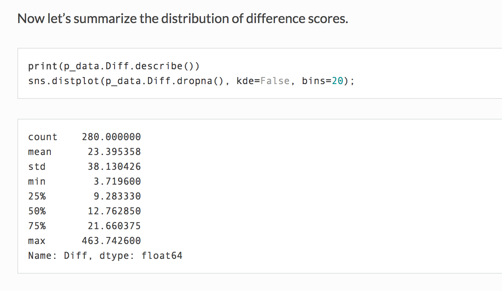
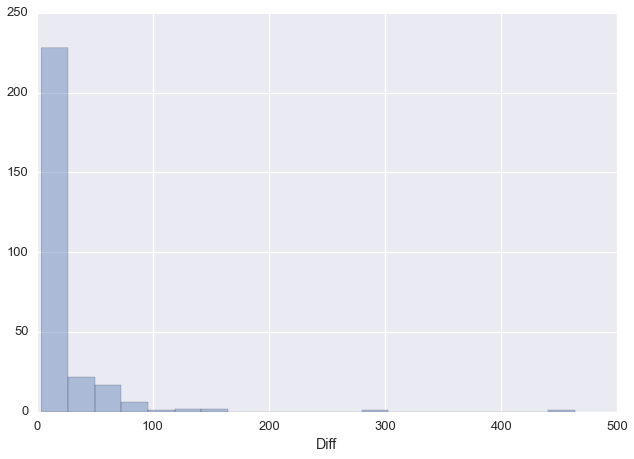
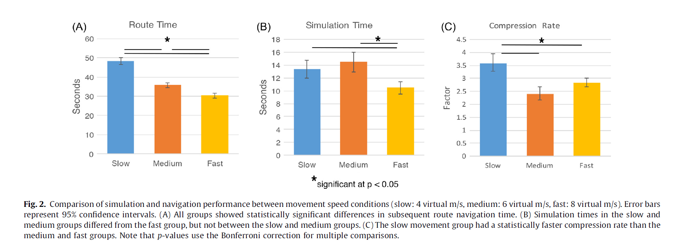

#### Article ID: IeIFy
#### Pilot: Sara Kessler
#### Co-pilot: Tom Hardwicke  
#### Start date: 03/20/2017
#### End date: 05/10/2017

-------

#### Methods summary: 

Arnold et al. (2016) investigated whether temporal information from previous experiences is retained in mental simulations, hypothesizing that "simulated episodes contain temporal aspects of the experiences the simulation is recapitulated from, albeit in a compressed form" (Arnold et al., 2016, p. 15). In order to investigate this question, participants were shown a video from a first person perspective of a walk around the perimeter of a virtual city which had five visually salient landmarks in it. The landmarks were pointed out and introduced. Participants then underwent 20 encoding trials in which they had to navigate between two landmarks, as quickly as possible. Finally, the participants had a simulation phase where they were shown images of two landmarks and then had to close their eyes and mentally simulate navigating from one to the other, imagining their route in detail.  They were asked to use the quickest route possible, not necessarily one they had used in the encoding phase. After the mental simulation they answered a questionnaire to probe qualitative aspects of the simulations. Then they had to navigate the actual route in the virtual city as quickly as possible, followed by another questionnaire about how well they navigated the route, and how closely their simulation matched the actual navigation. There were 10 routes in the simulation phase. 

------

#### Target outcomes: 
The target outcomes for this article are outlined in Section 2.1.3 of Arnold et al. (2016):

> Inspection of the route time histogram from the simulation phase revealed a number of trials in which participants became “lost” (see Fig. S1), which skewed the distribution. To control for this, we calculated the difference between the optimal route time and the observed route time (mean difference score = 14.27s; SD = 19.49). The resulting distribution was then used to remove trials in the top 25% of difference scores across participants (75% quartile = 21.66 s, 70 trials removed). This filtering strategy allowed for retention of variance in route time, while excluding trials that took approximately double the optimal route time (M = 24.85 s, SD = 7.16). Route performance on the filtered data set of 210 trials was near the optimal route time (mean difference score = 5.93 s, SD = 3.54).

> Next, we assessed the relationship between simulation time (M = 14.41, SD = 11.21) and route navigation time (M = 35.81, SD = 9.25; see Fig. 2a–b). Simulation times were first mean-centered for each participant, providing a more precise estimate of coefficients as it minimizes variance in simulation time due to individual differences in overall temporal compression rate. We found a statistically significant positive correlation between the time it took a participant to subsequently navigate the route and the time it took them to mentally simulate it (r(208) = 0.30, p < 0.001, R2 = 0.09, Fig. 3C). We also found a significant positive correlation between simulation time and route distance (r(208) = 0.29, p < 0.001, R2 = 0.08); however, route time and distance for each trial were highly collinear (r(208) = 0.97, p < 0.001, R2 = 0.94). As such, the remainder of the analysis focuses on route time, which accounts for variance in non-movement related processes (e.g. making decisions at turning points) that are not represented in the distance measure. Our correlation reported here between simulation and route time is consistent with past findings from Kosslyn et al. (1978) who showed a correlation between the time it took participants to mentally scan between different locations on a map of an island and the physical distance between them.

------

```{r global_options, include=FALSE}
knitr::opts_chunk$set(echo=TRUE, warning=FALSE, message=FALSE)
```

## Step 1: Load packages

```{r}
library(tidyverse) # for data munging
library(knitr) # for kable table formating
library(haven) # import and export 'SPSS', 'Stata' and 'SAS' Files
library(readxl) # import excel files
library(CODreports) # custom report functions
sem <- function(x) {sd(x, na.rm=TRUE) / sqrt(length(x))} # custom function to calculate standard error of the mean
ci95 <- function(x) {sem(x) * 1.96} # custom function to calculate 95% confidence intervals
```

## Step 2: Load data

```{r}
d_raw <- read_csv("data/data3.csv")
d_filtered <- read_csv("data/data1.csv")
```

## Step 3: Tidy data

```{r}
#The optimal times were copied out of data_1 for subject 26 in group 1 who had none of their trials excluded
opt_times <- d_filtered %>%
  filter(Group == 1, Participant == 26) %>%
  select(Optimal)
num_subs <- length(unique(d_raw$Participant))

d_tidy <- d_raw %>%
  rename(trial_num = X1, 
         obs_route_time = Path_Time, 
         distance = Distance, 
         sim_time = Sim_Time, 
         subid = Participant) %>%
  select(subid, trial_num, obs_route_time, distance, sim_time)%>%
  mutate(optimal_route_time = rep(opt_times$Optimal,num_subs))
```

## Step 4: Run analysis

### Pre-processing

Let's try and reproduce these outcomes:

> Inspection of the route time histogram from the simulation phase revealed a number of trials in which participants became “lost” (see Fig. S1), which skewed the distribution. To control for this, we calculated the difference between the optimal route time and the observed route time (mean difference score = 14.27s; SD = 19.49).

```{r}
d <- d_tidy %>%
  mutate(diff = obs_route_time - optimal_route_time)

summary(d$diff)
mean_diff <- mean(d$diff)
sd_diff <- sd(d$diff)

compareValues(reportedValue = 14.27, obtainedValue = round(mean_diff, 2))
compareValues(reportedValue = 19.49, obtainedValue = round(sd_diff, 2))
```
These summary statistics appear to differ substantially from the values reported in the article, but DO match the information reported in the analysis script provided in the supplementary materials as this screenshot shows:



Let's plot a histogram for the distribution of difference scores:
```{r}
ggplot(d, aes(x=diff)) +
    geom_histogram(binwidth=20, boundary = 0, colour="black", fill="white")
```

and compare to supplementary figure 1 from the original article:



The distributions appear to be very similar but the first two bins are different. We have used bins of 20 as the code in the supplementary material appears to indicate:

> sns.distplot(p_data.Diff.dropna(), kde=False, bins=20);

So it is unclear why there is a difference.

Now we look at the filtering strategy of removing the top 25% of difference scores:

> The resulting distribution was then used to remove trials in the top 25% of difference scores across participants (75% quartile = 21.66 s, 70 trials removed). 

```{r}
# filter out the top 25% of difference times
top_quant <- quantile(d$diff, .75) # identify cut-off for top 25% quantile
compareValues(reportedValue = 21.66, obtainedValue = round(top_quant, 2))

d_topFilter <- d %>%
  filter(d$diff < top_quant) # apply filter

n_prefilter <- nrow(d) # number of rows pre-filter
n_postfilter <- nrow(d_topFilter) # number of rows remaining.
n_removed <- n_prefilter - n_postfilter # number of rows removed
compareValues(reportedValue = 70, obtainedValue = n_removed)
```

The top quantile matches what was reported in the paper, and the same number of trials were filtered out using this criterion. Strangely it does not match what was reported in the text of the supplementary materials:

> First, we're going to remove the top quartile, which means any trial with a difference score that exceeds 14.95 seconds.

...but does match the value shown in the descriptive statistics screenshot shown above (i.e., 75% quantile = 21.66).


### Descriptive statistics

Let's try to reproduce these target outcomes:

> This filtering strategy allowed for retention of variance in route time, while excluding trials that took approximately double the optimal route time (M = 24.85 s, SD = 7.16).

```{r}
mean_opt = mean(opt_times$Optimal)
sd_opt = sd(opt_times$Optimal)

compareValues(reportedValue = 24.85, obtainedValue = round(mean_opt, 2))
compareValues(reportedValue = 7.16, obtainedValue = round(sd_opt, 2))
```

Now let's try to reproduce these target outcomes:

> Route performance on the filtered data set of 210 trials was near the optimal route time (mean difference score = 5.93 s, SD = 3.54).

```{r}
mean_diff_filt <- mean(d_topFilter$diff)
sd_diff_filt <- sd(d_topFilter$diff)

compareValues(reportedValue = 5.93, obtainedValue = round(mean_diff_filt, 2))
compareValues(reportedValue = 3.54, obtainedValue = round(sd_diff_filt, 2))
```
There is a discrepancy in the mean and sd of difference scores. Again, the values we obtained in our reanalysis appear to match values reported in the supplementary materials (Table 3) but not in the main article.

Now let's try and reproduce the following target outcomes:

> Next, we assessed the relationship between simulation time (M = 14.41, SD = 11.21)...

```{r}
mean_sim_time <- mean(d_topFilter$sim_time)
compareValues(reportedValue = 14.41, obtainedValue = round(mean_sim_time, 2))

sd_sim_time <- sd(d_topFilter$sim_time)
compareValues(reportedValue = 11.21, obtainedValue = round(sd_sim_time, 2))
```

> and route navigation time (M = 35.81, SD = 9.25; see Fig. 2a–b). 

```{r}
mean_nav_time <- mean(d_topFilter$obs_route_time)
compareValues(reportedValue = 35.81, obtainedValue = round(mean_nav_time, 2))

sd_nav_time <- sd(d_topFilter$obs_route_time)
compareValues(reportedValue = 9.25, obtainedValue = round(sd_nav_time, 2))
```

The reported mean and SD for simulation time and route navigation times match those that we found here.

```{r}
d_g1<-d_topFilter %>%
  mutate(group = 1) %>%
  group_by(group) %>%
  summarize(mean = mean(obs_route_time),
            cis = ci95(obs_route_time))
ggplot(data=d_g1, aes(x=group, y=mean)) +
    geom_bar(stat="identity", fill="#FF6600") +
    geom_errorbar(aes(ymin=mean-cis, ymax=mean+cis),
                  width=.2, position=position_dodge(.9)) + xlab("Medium") + ylab("Seconds") + ggtitle("Route Time") +
  scale_x_discrete(breaks=NULL)
```

```{r}
d_g2<-d_topFilter %>%
  mutate(group = 1) %>%
  group_by(group) %>%
  summarize(mean = mean(sim_time),
            cis = ci95(sim_time))
ggplot(data=d_g2, aes(x=group, y=mean)) +
    geom_bar(stat="identity", fill="#FF6600") +
    geom_errorbar(aes(ymin=mean-cis, ymax=mean+cis),
                  width=.2, position=position_dodge(.9)) + xlab("Medium") + ylab("Seconds") + ggtitle("Simulation Time") +
  scale_x_discrete(breaks=NULL)
```




My figures seem to match the middle (orange) bars of Figures 2a and 2b.

> Simulation times were first mean-centered for each participant, providing a more precise estimate of coefficients as it minimizes variance in simulation time due to individual differences in overall temporal compression rate.

```{r}
#mean center the simulation times for each participant then rejoin them with the rest of the data.
d_centered <- d_topFilter %>%
  group_by(subid)%>%
  mutate(centered_sim_time = scale(sim_time, center = T, scale = F)[,1])%>%
  group_by(subid, trial_num, add = FALSE) %>%
  summarize(centered_sim_time = mean(centered_sim_time))

d_topFilter <- right_join(d_topFilter, d_centered)
```


### Inferential statistics

> We found a statistically significant positive correlation between the time it took a participant to subsequently navigate the route and the time it took them to mentally simulate it (r(208) = 0.30, p < 0.001, R2 = 0.09, Fig. 3C).

```{r}
cor.out <- cor.test(d_topFilter$obs_route_time, d_topFilter$centered_sim_time)

compareValues(reportedValue = 208, obtainedValue = cor.out$parameter) # df
compareValues(reportedValue = .30, obtainedValue = round(cor.out$estimate, 2)) # r
compareValues(reportedValue = .09, obtainedValue = round(cor.out$estimate^2, 2)) # r2
```
MATCH - The exact p-value is not reported in the paper, but by eyeballing we can see that the obtained value matches the reported boundary.

Using the centered simulation times for each participant, we found the same significant positive correlation between the time it took a participant to subsequently navigate the route and the time it took them to mentally simulate it as was found in the paper.

> We also found a significant positive correlation between simulation time and route distance (r(208) = 0.29, p < 0.001, R2 = 0.08);

```{r}
cor.out <- cor.test(d_topFilter$distance, d_topFilter$centered_sim_time)

compareValues(reportedValue = 208, obtainedValue = cor.out$parameter) # df
compareValues(reportedValue = .29, obtainedValue = round(cor.out$estimate, 2)) # r
compareValues(reportedValue = .08, obtainedValue = round(cor.out$estimate^2, 2)) # r2
```
MATCH - The exact p-value is not reported in the paper, but by eyeballing we can see that the obtained value matches the reported boundary.

> however, route time and distance for each trial were highly collinear (r(208) = 0.97, p < 0.001, R2 = 0.94). As such, the remainder of the analysis focuses on route time, which accounts for variance in non-movement related processes (e.g. making decisions at turning points) that are not represented in the distance measure. Our correlation reported here between simulation and route time is consistent with past findings from Kosslyn et al. (1978) who showed a correlation between the time it took participants to mentally scan between different locations on a map of an island and the physical distance between them.

```{r}
cor.out <- cor.test(d_topFilter$distance, d_topFilter$obs_route_time)

compareValues(reportedValue = 208, obtainedValue = cor.out$parameter) # df
compareValues(reportedValue = .97, obtainedValue = round(cor.out$estimate, 2)) # r
compareValues(reportedValue = .94, obtainedValue = round(cor.out$estimate^2, 2)) # r2
```

MATCH - The exact p-value is not reported in the paper, but by eyeballing we can see that the obtained value matches the reported boundary.

## Step 5: Conclusion

```{r}
codReport(Report_Type = 'joint',
          Article_ID = 'IeIFy', 
          Insufficient_Information_Errors = 0,
          Decision_Errors = 0, 
          Major_Numerical_Errors = 4, 
          Minor_Numerical_Errors = 1,
          Author_Assistance = T)
```

We found that the inferential statistics were congruent with those reported in the paper. However, there were inconsistencies with some of the descriptive statistics reported in the paper. The mean and SD of the difference score between the optimal route time and the observed route time were different, as were the mean and SD of the difference score of the filtered data. 

We contacted the original authors for clarification and they confirmed that the aforementioned values reported in the article are incorrect. The values obtained in our reanalysis, and reported in the original supplementary materials, are the correct values. The authors have indicated that they will contact the journal to correct these errors. Note that the errors do not appear to impact upon the substantive statistical conclusions of the article.


```{r session_info, include=TRUE, echo=TRUE, results='markup'}
devtools::session_info()
```
